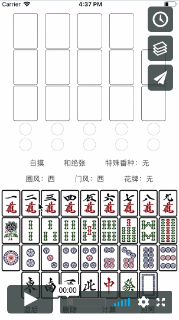

# Mahjong Scorer

国标麻将计分器(iOS)

(目前只支持中文，后续将支持英文)

国标麻将番种众多。 对于初学者来说，最大的困难之一是识别番种与计算番数。 此iOS应用程序可帮助您进行所有计算。您只需指定获胜时的14张牌。 它可以被用来在实战中计算番种，或是学习国标麻将的番种规则。

支持所有81个番种。

An iOS app for calculating mahjong scores ([Chinese official competition rules](https://en.wikipedia.org/wiki/Mahjong_Competition_Rules)).

(Currently only in chinese, english version will be added in the future.)

The Mahjong Competition Rule, is characterised by dozens of possible combinations and a rather complex and inventive set of patterns. One of the majoy difficulties for beginners is to regconize patterns and calculate the corresponding scores. This iOS app helps to do all the calculation and you just need to specify the 14 tiles when you win. It can be used in games, as well as learning the competitional rules. 

All 81 patterns are supported.

